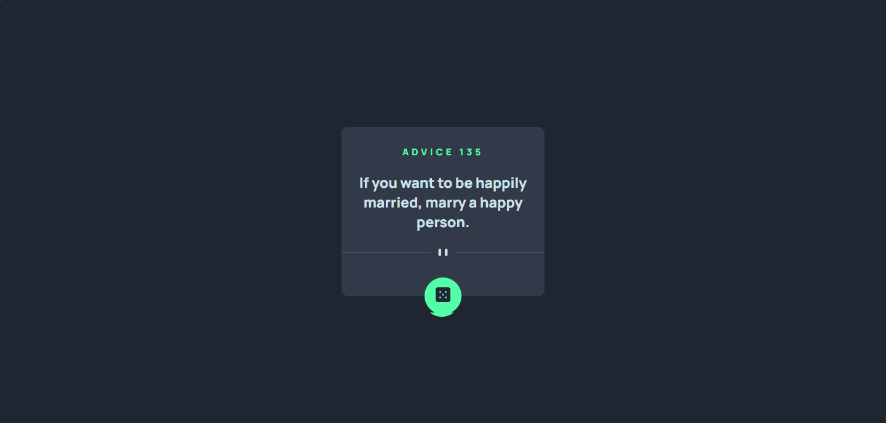
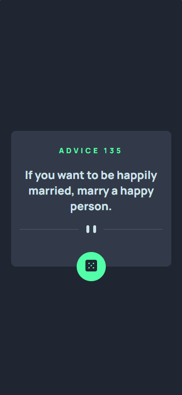

# Frontend Mentor - Advice generator app

## Table of contents

- [Visão Geral](#visão-geral)
  - [Sobre o Desafio](#sobre-o-desafio)
  - [Screenshot](#screenshot)
  - [Links](#links)
- [My process](#my-process)
  - [Built with](#built-with)
  - [What I learned](#what-i-learned)
  - [Continued development](#continued-development)
  - [Useful resources](#useful-resources)
- [Author](#author)
- [Acknowledgments](#acknowledgments)

## Visão Geral

### Sobre o Desafio 

Os usuários devem ser capazes de:

- Visualizar o layout ideal para o aplicativo, dependendo do tamanho da tela do dispositivo.
- Veja os estados de foco para todos os elementos interativos na página.
- Gere um novo conselho clicando no ícone de dados.

### Screenshot

*Screenshot desktop com tamanho de 1440px*

 

*Screenshot desktop com tamanho de 375px*

 

### Links

[Pagina do projeto](https://mariaeduardanascimento.github.io/adviceGeratorApp/)

## Meu processo

### Construido com

- Marcação semântica HTML5
- Personalizado com propriedades CSS
- Flexbox
- Design responsivo
- JavaScript:
    - Event DOM
    - API
    - Async/ awayt

### O que eu aprendi 

Nesse projeto pude testar meu conhecimento ao fazer uso de API. 

## Tecnologias Utilizadas

 

## Autor(a)

 

>Maria Eduarda Nascimento

   